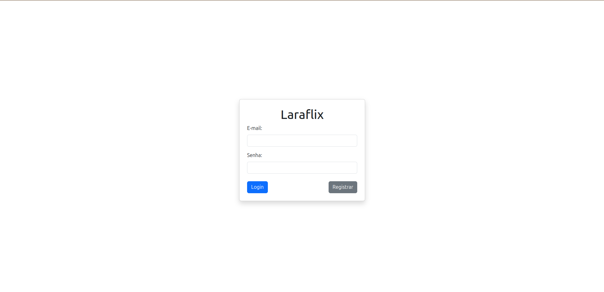

# Laraflix 



> Aplicação de catálogo de filmes estilo Netflix, desenvolvida com Laravel. Permite autenticação, listagem e interação com os conteúdos.

### ✅ Ajustes e melhorias

O projeto ainda está em desenvolvimento:

- [x] Criar conta  
- [x] Login de conta
- [x] Logout com método DELETE  
- [x] Criar perfil de usuário  
- [x] Listar perfis  
- [ ] Integração com API do TheMovieDB  
- [ ] Buscar filmes  
- [ ] Marcar filmes como "para assistir"  
- [ ] Visualizar lista de "para assistir"  
- [ ] Marcar filmes como "assistidos"  
- [ ] Visualizar perfil do usuário  
- [ ] Página de recomendações (opcional)  

## 💻 Pré-requisitos

Antes de começar, você vai precisar ter instalado na sua máquina:

- PHP ^8.1
- Composer
- Node.js e NPM
- PostgreSQL ou outro banco compatível
- Laravel CLI

> Recomendado para sistemas Linux ou WSL. Funciona também em Windows com ambiente configurado (Laragon, XAMPP, etc).

## 🚀 Instalando Laraflix

Clone o projeto e instale as dependências:

```bash
git clone https://github.com/murilloudev/laraflix.git
cd laraflix
composer install
npm install && npm run dev
cp .env.example .env
php artisan key:generate
 ```

Desenvolvido com 💙 por [Murillo Vinícius](https://github.com/Murillou)
